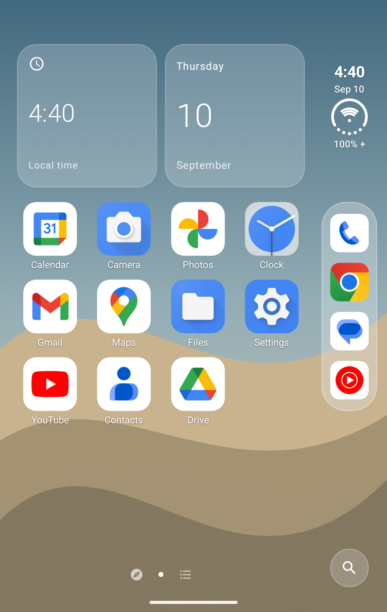
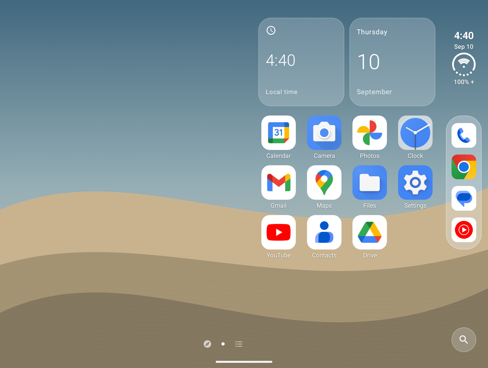

# iDuoHome

**DuoLauncher를 기반으로 갤럭시 Z 폴드8에 맞춰 다듬은 Android 런처입니다.** 오른쪽 독과 접었을 때·펼쳤을 때 이어지는 홈 화면을 중심으로, Folduo의 유리 전환 효과를 런처에 통합했습니다.

## 원본 프로젝트와 변경 사항

### DuoLauncher 기반 수정

[jakesgoodapps/DuoLauncher](https://github.com/jakesgoodapps/DuoLauncher)의 Kotlin·Jetpack Compose 런처를 기반으로 합니다. 오른쪽 독, 펼쳤을 때 겹쳐 이동하는 홈 페이지, Android 위젯, 폴더, Google Discover, 배치 백업은 원본에서 이어받은 기능입니다.

iDuoHome에서는 다음 부분을 수정하고 확장했습니다.

| 영역 | 수정·반영한 내용 |
| --- | --- |
| 앱 이름과 패키지 | 앱 이름을 **iDuoHome**, 패키지를 `kr.me.nulld.iduohome`으로 변경하고 런처 아이콘을 교체했습니다. |
| 폴드 화면 배치 | 홈 격자를 **4열 × 7행**으로 확장했습니다. 내부 화면에서도 커버 화면에서 측정한 격자 너비와 간격을 활용하고, 세로 공간이 부족하면 스크롤할 수 있도록 했습니다. 기존 6행 배치의 저장 데이터도 변환합니다. |
| 오른쪽 독 | 고정 앱 수를 **4~6개**로 설정하도록 정리했습니다. 최근 앱의 자동 표시를 제거하고, 독이 가득 찼을 때 기존 앱을 자동으로 밀어내지 않도록 했습니다. |
| 앱·위젯 편집 | 항목 옆에 열리는 팝업 메뉴, 여러 홈 항목 선택·삭제, 위젯 가장자리를 끄는 크기 조절을 적용했습니다. 위젯끼리 자리를 바꾸거나 위젯 이동으로 가려지는 앱을 빈자리로 옮기는 배치 처리도 보완했습니다. |
| 앱 목록과 Discover | 한글 앱 이름을 **ㄱ·ㄴ·ㄷ 초성**으로 묶고, Discover 표시를 켜고 끄는 옵션을 추가했습니다. 펼친 화면의 전체 앱 목록 배치와 홈으로 돌아오는 흐름도 조정했습니다. |
| 배경화면 | 커버·내부 화면용 밝은 배경과 어두운 배경을 구분했습니다. 기본 배경은 설정한 위치의 일출·일몰에 따라 전환하며, 개인 사진과 시스템 배경화면도 선택할 수 있습니다. |
| 한국어 설정 | 설정 메뉴, 초기 안내, 권한·오류·백업 안내를 한국어로 제공합니다. 영문·한국어 설정 리소스 **각 305개**를 분리하고 Android의 앱별 언어 선택을 연결했습니다. |
| 화면 복귀 | 화면 재생성 시 앱 목록과 아이콘을 메모리에서 재사용하도록 보완했습니다. |

### Folduo를 수정해 반영한 접기·펼치기 효과

[bunkaich/Folduo](https://github.com/bunkaich/Folduo)는 갤럭시 Z 폴드7을 대상으로 힌지 각도에 따른 반투명 유리 전환을 구현한 프로젝트입니다. iDuoHome은 Folduo의 **`GlassProjection`, `FoldPolicy.blur`, 셰이더 투영 계산**을 수정해 홈 화면에 적용했습니다. 반영 기준은 [Folduo 커밋 `c9e5976`](https://github.com/bunkaich/Folduo/tree/c9e5976cf1d5176652fcf0fc984bb5ec86751d29)입니다.

| 영역 | iDuoHome에 적용한 방식 |
| --- | --- |
| 화면 효과 | 접기·펼치기에 따라 홈 화면의 원근감과 흐림 정도를 바꿉니다. 내부 화면에서는 오른쪽 영역의 선명도를 유지합니다. |
| 렌더링 | 런처가 직접 그리는 홈 화면과 위젯에 GPU 효과를 적용합니다. Android 13 이상은 투영·유리 효과, Android 12는 기본 흐림 효과를 사용합니다. |
| 각도 입력 | Android 표준 힌지 센서가 서로 다른 중간 각도를 제공하는지 확인한 뒤 각도에 맞춰 효과를 바꿉니다. |
| 대체 동작 | 센서가 0°·90°·180° 같은 접힘 상태만 제공하거나 각도 연동을 끄면, 접힘 상태 또는 커버·내부 화면이 바뀔 때 짧은 전환 효과를 재생합니다. |
| 런처 설정 | 효과 켜기·끄기, 각도 연동 켜기·끄기, 효과 강도 조절을 추가했습니다. **효과는 기본적으로 꺼져 있습니다.** |
| 실행 조건 | 홈이 보일 때 동작하며 편집·다중 창에서는 중지합니다. Android의 애니메이션 삭제 설정을 따릅니다. |

원본의 Shizuku 연결, 화면 캡처, 전용 배경화면 도우미, 삼성 비공개 디스플레이 제어는 포함하지 않았습니다. iDuoHome의 효과에는 별도의 화면 캡처·다른 앱 위에 표시 권한이 필요하지 않습니다. **효과 범위는 런처 홈이며, 시스템 배경화면·다른 앱·잠금 화면에는 적용되지 않습니다.** 커버와 내부 디스플레이가 켜지고 꺼지는 시점은 Android가 제어합니다.

각도의 정밀도는 기기와 펌웨어가 제공하는 센서 값에 따라 달라집니다. 폴드8의 실제 접기 동작에서 연속 각도가 제공되는지는 추가 실기 확인이 필요합니다.

## 화면 예시

<p>
  
  
</p>

기존 에뮬레이터 테스트 화면입니다. 최신 한국어 메뉴와 배경 변경 사항이 모두 반영된 이미지는 아닙니다.

## 설치와 시작

**실험적 베타 · Android 12 이상.** 주 대상 기기는 갤럭시 Z 폴드8이며, 실기 확인 환경은 Android 17입니다. 다른 폴더블의 화면 비율이나 센서 동작까지 호환을 보장하지는 않습니다.

1. 이 저장소의 배포 APK 또는 직접 빌드한 APK를 설치하고 **iDuoHome**을 엽니다.
2. 홈 화면을 확인한 뒤 **기본 홈 앱으로 설정**을 선택합니다. Android의 홈 앱 선택 화면에서 iDuoHome을 지정합니다.
3. 홈의 빈 공간을 길게 눌러 **런처 맞춤 설정**을 엽니다. 위젯 추가와 배경화면 변경도 이 메뉴에서 시작할 수 있습니다.
4. 접힘 효과는 **배경화면 및 테마 → 접기·펼치기 효과 → 반투명 유리 전환 효과**에서 켭니다. 필요하면 **지원 시 접힘 각도에 맞추기**와 **효과 강도**를 조절합니다.

이전 런처로 돌아가려면 Android의 **설정 → 앱 → 기본 앱 → 홈 앱**에서 선택하세요. 기기에 따라 메뉴 이름은 다를 수 있습니다.

업데이트는 동일한 패키지와 서명 키를 사용해야 합니다. 앱 삭제나 저장 공간 초기화는 저장된 배치와 위젯 연결을 지웁니다. 직접 빌드한 APK와 배포 APK의 서명이 다르면 덮어 설치할 수 없습니다. 자세한 내용은 [배포·업데이트 안내](docs/public-release.md)를 참고하세요.

## 기본 조작

| 할 일 | 조작 |
| --- | --- |
| 홈 페이지 이동 | 홈 화면이나 오른쪽 독에서 좌우로 밀기 |
| 펼친 홈 사용 | 왼쪽 추가 공간 + 홈 1, 홈 1 + 홈 2처럼 이어지는 페이지 쌍으로 이동 |
| 전체 앱 열기 | 마지막 홈 페이지에서 한 번 더 넘기거나 전체 앱 버튼 누르기 |
| Discover 열기 | 첫 홈 페이지에서 오른쪽으로 밀기. **제스처 및 검색**에서 표시 여부 설정 |
| 앱·위젯 이동 | 길게 누른 뒤 끌기. 화면 가장자리에서 잠시 멈추면 페이지 이동 |
| 항목 메뉴·위젯 크기 조절 | 길게 누른 뒤 이동하지 않고 놓기. 위젯은 나타난 가장자리 손잡이로 크기 조절 |
| 독에 앱 고정 | 독의 빈자리로 끌기. **홈 화면 배치 → 독에 고정할 앱 수**에서 자리 수 설정 |
| 위젯 내용 스크롤 | 위젯 안에서 세로로 밀기 |
| 알림창·빠른 설정 | 접근성 기능을 켠 뒤 홈의 왼쪽 70%·오른쪽 30% 영역에서 아래로 밀기 |
| 화면 잠금 | 옵션을 켠 뒤 홈의 빈 공간을 두 번 누르기. 접근성 기능 필요 |
| 배치 저장·복원 | **런처 맞춤 설정 → 백업**에서 저장하거나 복원 내용 확인 후 적용 |

### 설정 언어

기기 언어에 따라 한국어 또는 영어가 적용됩니다. Android 13 이상에서는 시스템의 앱별 언어 설정으로 iDuoHome의 언어만 선택할 수 있습니다. 다른 앱·아이콘 팩·위젯 제공자가 정한 이름은 해당 제공자의 언어를 따릅니다.

- [한국어 설정 리소스](app/src/main/res/values-ko/settings.xml)
- [기본 영문 설정 리소스](app/src/main/res/values/settings.xml)
- [한국어 접힘 효과 리소스](app/src/main/res/values-ko/fold_effect.xml)

## 권한과 동작 범위

런처 자체 계정, 광고, 분석 도구, 자동 오류 전송 기능은 사용하지 않습니다. 배치와 선택한 사진은 사용자가 내보내거나 공유하기 전까지 기기에 저장됩니다.

- **위젯:** Android가 위젯 연결을 승인하도록 요청할 수 있으며, 제공 앱의 별도 설정이 필요할 수 있습니다.
- **알림창·화면 잠금 제스처:** 선택적으로 접근성 서비스를 사용합니다. 화면 내용 읽기나 다른 앱의 활동 관찰은 수행하지 않습니다.
- **일출·일몰:** 좌표를 직접 입력하거나 사용자가 요청할 때 대략적인 위치를 사용합니다. 백그라운드 위치 권한은 요청하지 않습니다.
- **사진:** 시스템 사진 선택기로 선택한 이미지에 접근합니다.
- **Google 기능:** 설치된 Google 앱의 계정·네트워크·개인정보 설정이 적용됩니다.

Discover의 동작은 Google 앱, Android 및 제조사 업데이트에 따라 달라질 수 있습니다. 업무 프로필의 앱과 위젯은 관리자 정책을 따르며, Private Space와 알림 점은 지원하지 않습니다. 폴더를 다른 폴더나 독 안에 넣을 수는 없습니다.

백업에서 복원한 Android 위젯은 다시 연결해야 합니다. 배경 사진과 실제 위젯 연결 권한은 배치 백업에 포함되지 않습니다. 접힘 효과 옵션은 기기에 저장되며 배치 백업과 별개입니다.

자세한 설명은 [개인정보 및 권한 안내](PRIVACY.md), [문제 해결](docs/troubleshooting.md), [사용 가이드](docs/user-guide.md)를 참고하세요.

## 빌드

**JDK 21, Android SDK 36, 저장소에 포함된 Gradle Wrapper**를 사용합니다. 최근 로컬 빌드는 JDK 21로 검증했습니다. `ANDROID_HOME` 또는 `local.properties`의 `sdk.dir`로 Android SDK 위치를 지정하세요.

Windows / PowerShell:

```powershell
.\gradlew.bat :app:assembleDebug :app:testDebugUnitTest :app:lintDebug
```

macOS / Linux:

```sh
./gradlew :app:assembleDebug :app:testDebugUnitTest :app:lintDebug
```

디버그 APK 출력 경로는 `app/build/outputs/apk/debug/app-debug.apk`입니다. 릴리스 빌드와 서명 설정은 [배포 안내](docs/public-release.md), 코드 구조는 [개발자 문서](docs/architecture.md)를 참고하세요. 기기 통합 테스트는 테스트용 에뮬레이터에서 실행합니다.

최근 변경 검증에는 단위 테스트 168개, 영문·한국어 설정 화면, 커버 화면의 큰 글씨, 설정 이동·배치 백업·접힘 효과 회귀 검사가 포함됩니다. 이는 실제 기기의 연속 힌지 각도나 모든 Google 앱 버전의 동작까지 검증했다는 의미는 아닙니다.

## 크레딧

이 프로젝트는 다음 오픈소스 프로젝트를 기반으로 만들어졌습니다. 원작자와 기여자 여러분께 감사드립니다.

| 프로젝트 | 제작자·기여자 | iDuoHome에서 사용한 부분 | 라이선스 |
| --- | --- | --- | --- |
| [DuoLauncher](https://github.com/jakesgoodapps/DuoLauncher) | **jakesgoodapps · Duo Launcher contributors** | 런처의 기반 코드, 오른쪽 독, 폴더블 홈 배치, 위젯·앱 관리와 설정 구조 | [MIT](LICENSE) |
| [Folduo](https://github.com/bunkaich/Folduo) | **bunkaich** | 접힘에 따른 유리 투영·흐림 계산과 셰이더를 수정해 홈 화면 효과로 적용 | [MIT](app/src/main/assets/licenses/MIT-Folduo.txt) |

원본 저작권과 라이선스 고지를 유지합니다. 의존성과 Folduo 반영 범위의 상세 고지는 [THIRD_PARTY_NOTICES.md](THIRD_PARTY_NOTICES.md)에 있습니다. 앱 아이콘과 위젯 콘텐츠는 각 제공자에게 귀속됩니다.

문제 제보에는 앱 버전, 기기 모델, Android 버전, 접힘 상태와 재현 방법을 함께 남겨주세요. [기여 안내](CONTRIBUTING.md) · [변경 이력](CHANGELOG.md)
